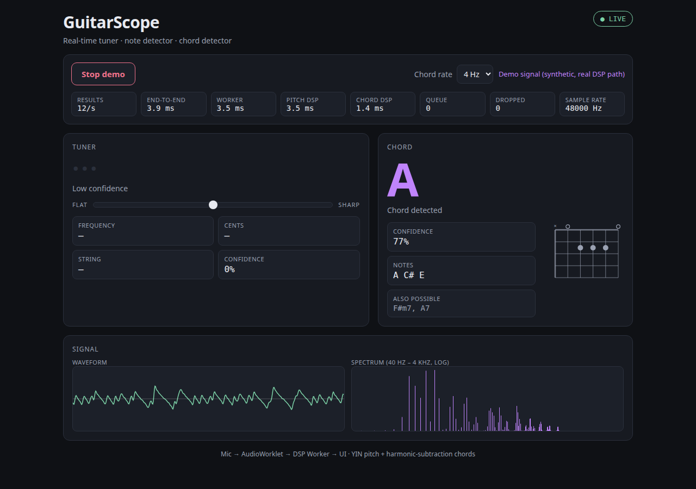
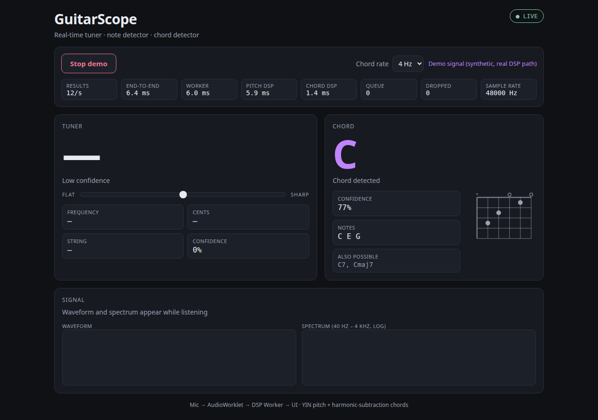
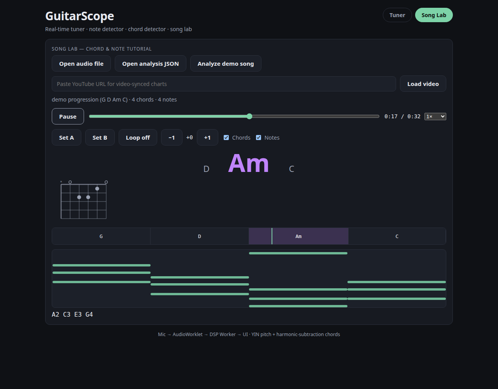
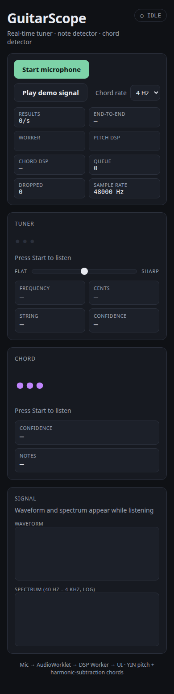

# GuitarScope — Real-time Guitar Tuner, Note & Chord Detector

A browser app that listens to your guitar through the microphone and tells you
**what you're playing**: the note, its tuning (±cents), the string, and the
chord — live, with measured accuracy and latency. No backend, no uploads;
all audio stays on your device.



## Features

- **Precision tuner** — big note readout, frequency (Hz), smoothed ±cents
  needle with FLAT/SHARP meter, per-string tuning verdict (IN TUNE / CLOSE /
  FLAT / SHARP) for standard tuning E2–E4.
- **Note + string detection** — YIN pitch detection with harmonic (HPS)
  validation and octave-error guard; honest *"No signal / Low confidence"*
  states instead of phantom notes.
- **Chord recognition** — major, minor, 7th, maj7, m7 across all roots
  (60-chord vocabulary, 132-chord extended set available), with confidence,
  constituent notes, alternatives, and open-position chord diagrams.
- **Live diagnostics** — waveform + log spectrum canvases, results/s rate,
  end-to-end latency, worker timings, queue depth and dropped-frame counters.
- **Demo mode** — no guitar handy? Plays a synthetic open-string + chord
  program through the real DSP path.
- **Phone testing** — HTTPS LAN server included (microphone requires a
  secure context; see below).



## Song Lab — learn songs (chords + notes over time)

The **Song Lab** tab turns full recordings into tutorials: upload any
audio file (or analyze the built-in demo song in one click) and get a
synced chord chart with playhead, piano-roll notes, loopable sections,
0.5×/0.75× slowdown, and display transposition — plus optional
YouTube-video sync (paste a URL; charts follow the video clock).



### Analyze a YouTube URL (local companion, opt-in)

The public web app does **not** download YouTube media — a pasted URL
only embeds the official player for sync. For local experimentation,
Song Lab offers an explicit *Local analysis* flow backed by a companion
process on your own machine that invokes your locally installed yt-dlp
and ffmpeg. Users are responsible for ensuring their use complies with
YouTube's Terms, applicable copyright/license terms, and local law.
GuitarScope does not host, redistribute, or commit downloaded media.

```bash
npm run songlab:server   # localhost only (127.0.0.1:8765), one job at a time
```

Then paste a single-video URL in Song Lab and click **Analyze**: the UI
shows connection status, job progress (download → decode → analyze),
and on completion loads the charts synced to the video. The analyzed
audio is retained server-side, so if the video blocks embedding,
playback automatically falls back to the analyzed audio with charts
still in sync. If the helper
isn't running you'll see exactly how to start it. Guardrails: YouTube
watch URLs only (no playlists/channels), 10-minute / 250 MB caps,
fixed yt-dlp argument array (never a shell string), temp files always
cleaned. Without the helper, audio-file upload works fully offline.

If downloads fail with HTTP 403, YouTube is challenging automated
retrieval from your network. In order: (1) update yt-dlp
(`yt-dlp -U`) and retry; (2) if you are logged into YouTube in a
browser, restart the helper with session cookies —
`YTDLP_COOKIES_FROM_BROWSER=chrome npm run songlab:server`
(use your browser name; env-only, never sent anywhere); (3) fall back
to downloading the audio yourself and uploading the file.

Analysis runs in a browser Worker (no server needed); the same pipeline
exists as an offline CLI (`npm run analyze -- --input song.wav ...`,
with a vocal-robust `--branches multi` mode). Details, fixture recipes
and validation numbers: [`analyzer/README.md`](analyzer/README.md).

What Song Lab actually promises (and what it doesn't):

- Chords over time with beat grid, tempo (with confidence), and
  strumming patterns (`D - D U - U D U` style) matched against a small
  curated library — plus a rolling tab staff with suggested fingerings.
- Down/up stroke labels are acoustic evidence only; uncertain strokes
  honestly show `?` instead of a guess (expect `?` on dense or
  simultaneous attacks).
- Tab shows **suggested** auto-fingering (concert pitch), never recovered
  exact fingering — verify by ear. Dense professional arrangements,
  slides/bends, capo/tuning inference, and neural stem separation are
  explicitly out of scope.

## Quick start

Requirements: Node 18+, Chrome/Edge (or any Chromium browser) for the full
feature set.

```bash
npm install
npm run dev        # open the printed localhost URL, click Start microphone
```

Useful scripts:

| Command | What it does |
|---|---|
| `npm run dev` | HTTP dev server (desktop mic works on localhost) |
| `npm run dev:https` / `npm run dev:lan` | HTTPS dev server, LAN-visible — **use this for phone testing** |
| `npm test` | 155 Vitest unit/integration tests |
| `npm run build` | Type-check + production build |
| `npm run lint` | oxlint |

## Usage guide

1. **Start** — click *Start microphone* and allow mic access (or *Play demo
   signal* to watch it work without an instrument).
2. **Tune** — play an open string. The needle shows cents deviation; green
   **IN TUNE** appears within ±5¢. The string cell reads e.g. *6th string*;
   fretted notes honestly show *(nearest)* instead of claiming a string.
3. **Play chords** — strum and the chord panel shows the name (e.g. *Am*),
   confidence, notes (*A C E*), close alternatives, and a fretboard diagram
   for common open shapes. Chord display settles in ~0.3–1 s by design
   (341 ms analysis window + confirmation), while the tuner stays at ~85 ms.
4. **Hear the demo** — *Play demo signal* is audible: the same scheduled
   source feeds both your speakers and the analyzer (demo is a virtual
   microphone through the real AudioWorklet → Worker path), so what you
   hear is exactly what is analyzed. The volume slider affects speakers
   only — detection gain is fixed.
5. **Record evidence** — *Session log* downloads the run as JSON (notes,
   chords, confidence, timings, queue stats) for reproducible bug reports.
4. **Chord rate** — switch 2/4/8 Hz analysis cadence live; watch the
   queue/dropped counters stay at zero.
5. **Uncertainty** — silence shows *No signal*, weak/polyphonic input on the
   tuner shows *Low confidence*, single notes on the chord panel show
   *Single note — strum a chord*. Nothing is ever invented.



## Phone testing (microphone needs HTTPS)

Phone browsers treat `http://<laptop-ip>` as an insecure context, so
`navigator.mediaDevices` doesn't exist and the app reports
*“Microphone needs HTTPS”*. Fix:

```bash
npm run dev:https
```

Open the printed `https://<laptop-ip>:5199` on the phone (same Wi-Fi) and
accept the self-signed certificate warning. If the warning blocks you,
alternatives in order: a `mkcert` trusted local cert, then an HTTPS tunnel.

## How it works

```
Mic → MediaStream → AudioWorklet (4096-sample framing only)
  → transferable Float32Array → DSP Worker → React UI
```

- **Pitch path** — 4096-sample frames → YIN estimator, validated against
  harmonic structure (HPS-style support scoring, sub-octave correction) →
  equal-temperament note math (`f = 440·2^((n−69)/12)`, cents =
  `1200·log2(f/fref)`) → open-string matching → confidence gating.
- **Chord path** — continuous 16384-sample ring → spectral peaks with
  parabolic interpolation → iterative harmonic subtraction against a
  calibrated guitar overtone profile → pitch-class (chroma) vector →
  cosine template matching → attack-onset hold + 2-confirmation stability
  gate before display.
- **Smoothing** — tuner needle: median window + EMA with instant reset on
  note change (raw value kept for debugging); chord labels: confirmation
  gate with fast collapse on lost signal.
- **Backpressure** — bounded latest-wins queue (capacity 2, drops counted);
  newer audio always beats stale audio.

Details and design rationale: [`docs/ADR-001-dsp-architecture.md`](docs/ADR-001-dsp-architecture.md).

## Measured results

Synthetic guitar-like signals (harmonic series + noise), desktop:

| Test | Result |
|---|---|
| Open strings E2–E4, clean + noisy + weak-fundamental E2 | 13/13, 0 octave errors |
| Chords incl. C7 / Cmaj7 / Cm7 / A7 / Am7 | 17/17 |
| Adversarial: ±15–20¢ detune, 50 Hz hum, hard clipping, weak thirds, doubled-note voicings | 8/8 |
| Full suite (`npm test`) | **155/155**, `tsc` + `oxlint` + `vite build` clean |
| Pitch DSP (4096 frame) | ~4–6 ms |
| Chord DSP (16384 window) | ~1–3 ms |
| Live worker turnaround @ 12 results/s | ~3–6 ms, queue 0, drops 0 |
| End-to-end capture → UI (steady state) | ~4–6 ms + 85 ms frame fill |
| Strum → stable chord display | ~0.3–1.0 s |

> Note: the End-to-end stat mixes the audio-capture clock with the UI
> clock. Under headless Chrome's fake/null audio devices the two clocks
> skew by a constant ~0.9 s (identical on mic and demo paths, constant
> over time, queues empty — an environment artifact, not app latency).
> On real hardware with a real audio clock they track; there, queue
> depth and dropped frames are the primary health signals.

Browser validation: headless-Chrome runs through real audio plumbing
(demo path + file-backed fake microphone) — all six open strings and
A/E/C chords detected, silence gaps correctly empty, zero console errors.

## Project structure

```
src/
  lib/dsp/        yin, fft, hps, spectral peaks, multi-pitch, chroma, synth fixtures
  lib/pitch/      fused pitch pipeline (gate → YIN → octave guard → notes)
  lib/notes/      frequency ↔ MIDI ↔ note names ↔ cents
  lib/guitar/     standard tuning, string ID, tuning verdicts
  lib/chords/     chord dictionary, template matcher
  lib/analysis/   DspEngine, frame queue, tuner smoother, chord stability gate
  lib/audio/      mic controller, frame assembler, worker protocol
  worklets/       self-contained AudioWorklet capture processor (+artifact test)
  workers/        DSP Worker (protocol glue around DspEngine)
  components/     TunerPanel, ChordPanel (+diagrams), SignalCanvas, ControlBar
  hooks/          useGuitarAudio (worker wiring, smoothing, demo program)
  test/           12 suites — DSP, pipeline, engine, browser-layer, benchmarks
```

## Known limitations

- Chord vocabulary is template-based (no ML): triads/7ths are solid in
  tests; dense voicings, heavy distortion and detuned instruments degrade it.
- Chord latency (~0.3–1 s) is inherent to the window + confirmation design.
- Brief transition artifacts are possible in the first ~300 ms after a change.
- String ID is nearest-open-string based, labeled honestly in the UI.
- No on-device mobile or real-guitar test yet. Start with the demo program,
  then play open strings → chords → muted/noisy variants, watching the
  uncertainty states; the adversarial suite (`src/test/adversarial.test.ts`)
  guards the baseline against regressions.

## License

MIT — see [LICENSE](LICENSE).
